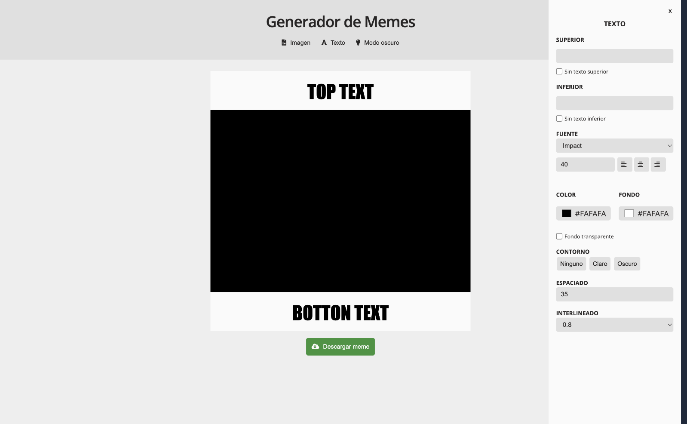
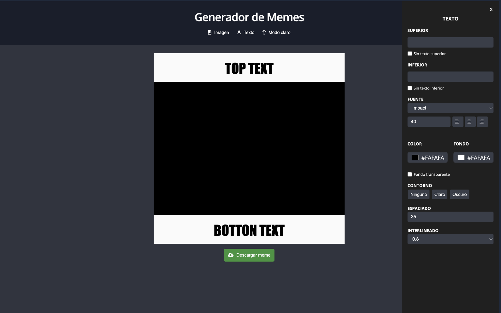
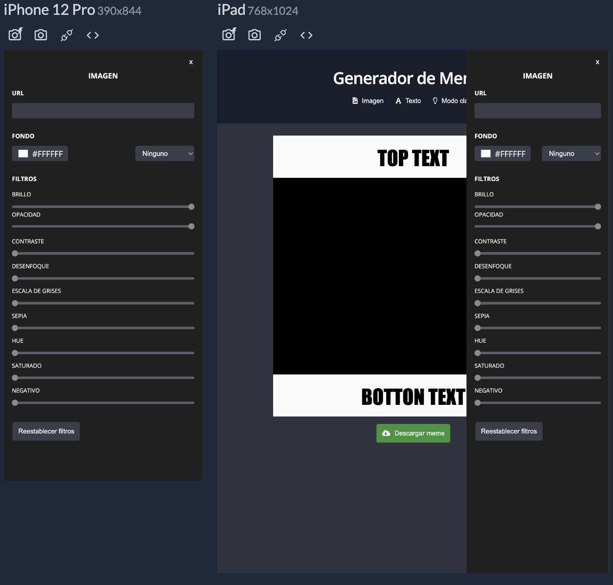
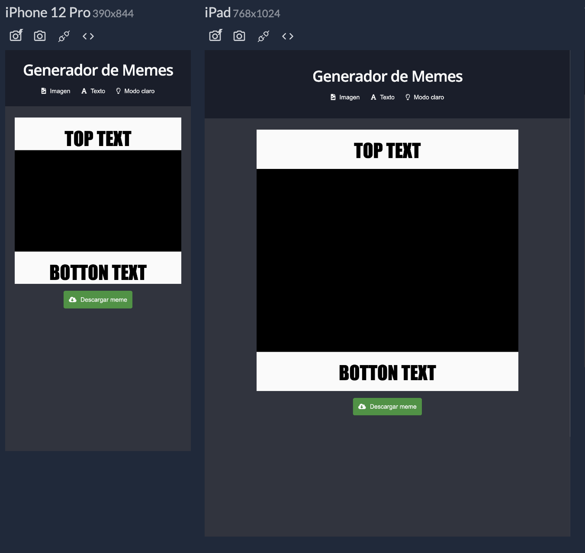
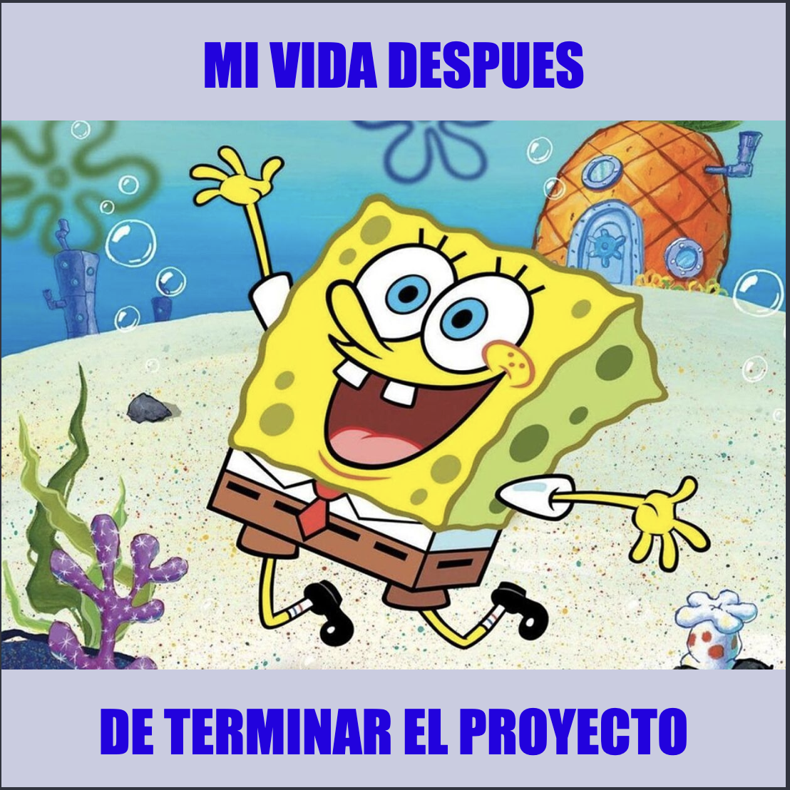
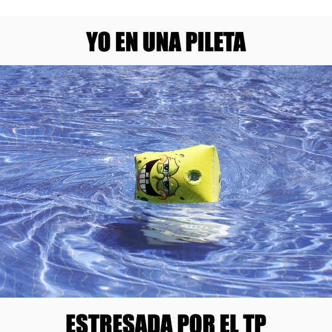

# Meme Generator 

## About the project 🌟

I present to you the meme generator, a project that he makes for the final javascript module - Ada Itw.

Link to project: https://github.com/hmarianj/meme-generator/deployments/activity_log?environment=github-pages

### Used technologies 💻
- Html (camelCase)
- CSS (responsive)
- Javascript (Variables, Conditionals, Functions, DOM, Events and Library (dom-to-image))

### Meme Generator Features ⚙️:

You will be able to create the memes that you like the most and download them

1. Upload the image of your choice
2. Edit top and bottom text
3. Delete either or both texts
4. Change the color of the texts and their background
5. Dark and light mode version
6. Have fun adding filters and colors to your image

## Project images 📸

## Meme Images :framed_picture:

Look at some pictures of my project

